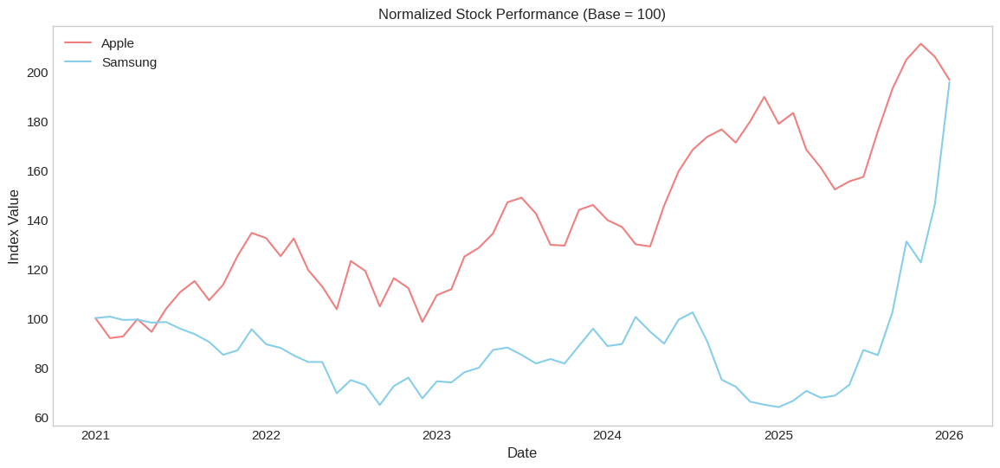
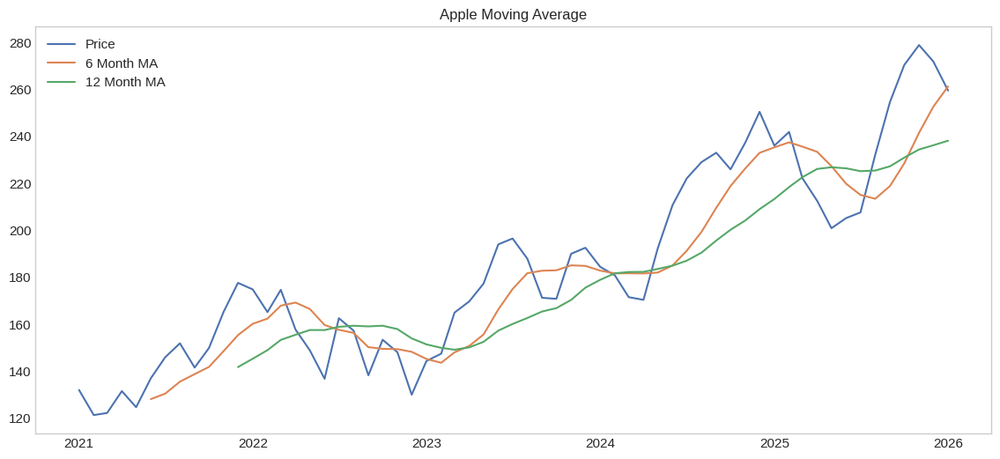
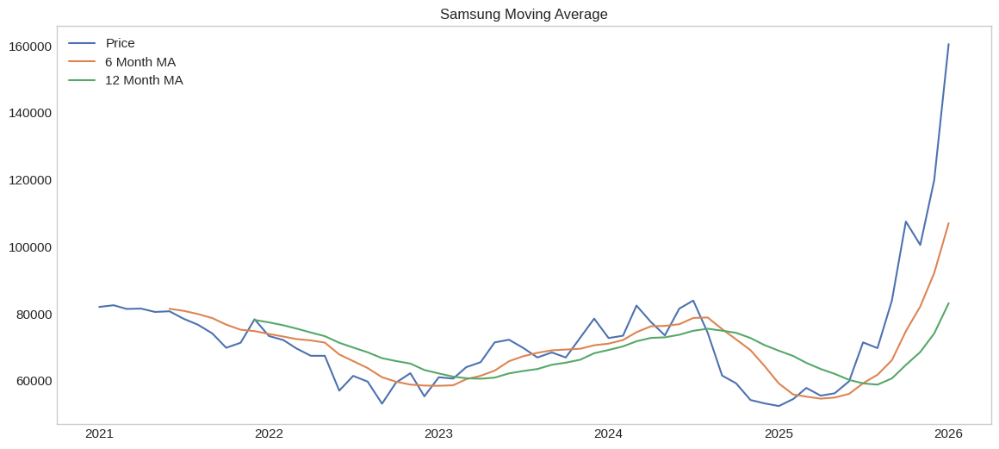
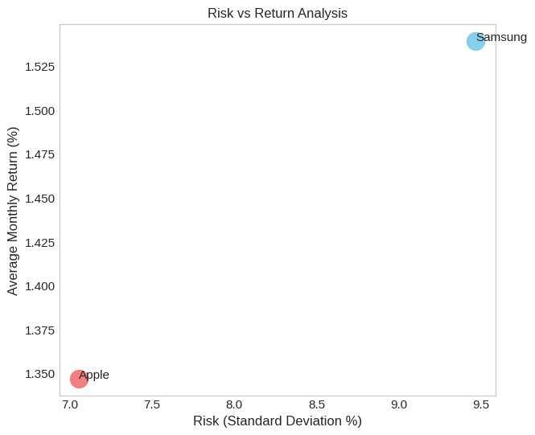
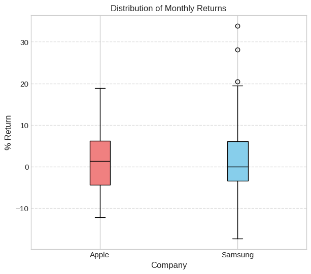
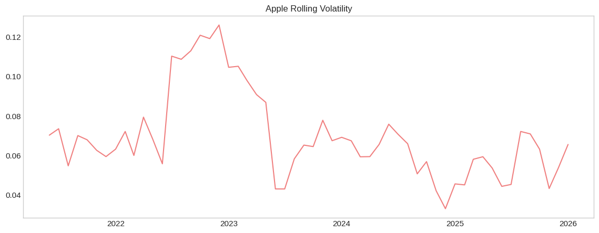
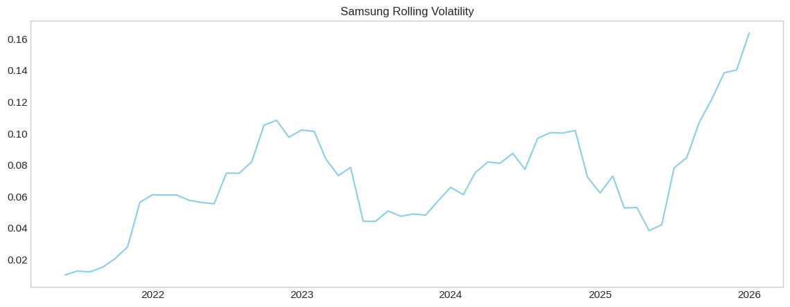

# 📈 Apple vs Samsung Stock Performance Analysis (2021–2026)


---

# 📖 Project Overview

This project presents a comprehensive comparative analysis of the historical stock performance of **Apple Inc. (AAPL)** and **Samsung Electronics** using monthly stock market data from **January 2021 to January 2026**.

The objective of this project is to apply **Business Analytics** and **Financial Data Analysis** techniques to evaluate the performance, growth, volatility, and investment potential of two of the world's largest technology companies.

The analysis was performed entirely in **Python** using **Google Colab**, demonstrating practical applications of data analytics, financial analysis, visualization, and statistical testing.

This project includes:

- 📈 Stock Performance
- 💹 Monthly Returns
- 📊 Moving Averages
- ⚡ Volatility
- 📦 Trading Volume
- 📉 Risk vs Return
- 📈 CAGR
- 📉 Maximum Drawdown
- 📊 Statistical Testing

---

## 📂 Dataset

| Feature | Details |
|---------|---------|
| Companies | Apple & Samsung |
| Period | Jan 2021 – Jan 2026 |
| Frequency | Monthly |
| Records | 60+ Months |
| Variables | Price, Open, High, Low, Volume, Change % |

The dataset was cleaned and validated before performing the analysis.

---

## 🛠 Tech Stack

| Tool | Purpose |
|------|----------|
| 🐍 Python | Programming |
| 🐼 Pandas | Data Analysis |
| 🔢 NumPy | Numerical Computing |
| 📊 Matplotlib | Visualization |
| 🎨 Seaborn | Statistical Charts |
| 📚 SciPy | Statistical Testing |
| ☁️ Google Colab | Development |

---

## 📸 Key Visualizations

### 📈 Normalized Stock Performance (Base = 100)



Apple maintained a consistently higher indexed value for most of the period, while Samsung stayed range-bound until a sharp late-2025 surge closed much of the performance gap.

---

### 📊 Moving Averages — Trend Confirmation

<table>
<tr>
<td></td>
<td></td>
</tr>
</table>

Apple's price tracks its 6- and 12-month moving averages in a smoother, steadier uptrend. Samsung shows a similar late-cycle breakout, but with a choppier run-up.

---

### 📉 Risk vs Return



Samsung sits in the higher-risk, higher-return quadrant (~9.5% monthly volatility, ~1.58% average return) versus Apple's lower-risk, lower-return profile (~7.1% volatility, ~1.35% return) — the clearest single chart summarizing the risk/return trade-off between the two stocks.

---

### 💹 Monthly Return Distribution



The side-by-side boxplot highlights Samsung's wider interquartile range and several extreme positive outliers (20–34% months), versus Apple's tighter, more contained spread — visual confirmation of Samsung's higher volatility.

---

### ⚡ Rolling Volatility

<table>
<tr>
<td></td>
<td></td>
</tr>
</table>

Apple's volatility spiked in 2022 before settling into a lower, calmer band. Samsung's volatility climbs sharply into 2026, aligning with its late-period rally.

---

### 🔗 Correlation Matrix


A correlation of just **0.25** between Apple and Samsung monthly returns indicates the two stocks move largely independently — supporting the case for diversification.

---

# 📌 Key Findings

- Apple demonstrated stronger long-term stock price growth.
- Samsung experienced greater price volatility.
- Apple produced more consistent monthly returns.
- Samsung exhibited higher investment risk.
- CAGR analysis indicated stronger annualized growth for Apple.
- Maximum Drawdown analysis highlighted Samsung's larger downside risk.
- Statistical analysis provided additional evidence for comparing investment performance.
- Diversification between both companies may help reduce portfolio risk.

---

# 💡 Recommendations

Based on the findings:

- Apple appears to be the stronger long-term investment due to its consistent growth and lower volatility.
- Samsung offers higher growth potential but with increased investment risk.
- Investors should consider diversification to balance returns and risk.
- Investment decisions should also account for macroeconomic conditions, technological developments, and company fundamentals.

---

# 📁 Repository Structure

```
apple-vs-samsung-stock-analysis/

│
├── Apple_vs_Samsung_Stock_Analysis.ipynb
├── Samsung_Apple_Stock_Analysis.xlsx
├── README.md
├── requirements.txt
└── images/
```

---

# 🚀 How to Run the Project

1. Clone this repository.

```bash
git clone https://github.com/yourusername/apple-vs-samsung-stock-analysis.git
```

2. Install the required libraries.

```bash
pip install -r requirements.txt
```

3. Open the Jupyter Notebook or upload the notebook to Google Colab.

4. Run all cells sequentially.

---

# 📌 Future Improvements

Potential enhancements include:

- Daily stock price analysis
- Forecasting using ARIMA or Prophet
- Machine Learning-based stock prediction
- Interactive dashboards using Plotly
- Streamlit web application
- Integration with live financial APIs

---

# 📚 References & Data Sources

- **Historical Stock Data:** Investing.com & Yahoo Finance!

---

# 🎧 Project Soundtrack

*This track was on loop while working on this project*

[if it's real then i'll stay - bonjr](https://open.spotify.com/track/6MIouIaP6WqE6o9Uo25gdO?si=1ba1cf60b9c54ee1)

**Star this repository if you found it interesting!** ⭐

made with ❤️ by **kazim**


#
